<!--
  ELHARCHAOUI-SIFEDDINE/ELHARCHAOUI-SIFEDDINE/README.md
  Repo name must match exactly: ELHARCHAOUI-SIFEDDINE
-->

<picture>
  <source media="(prefers-color-scheme: light)" srcset="assets/terminal-light.svg">
  
</picture>

 

<picture>
  <source media="(prefers-color-scheme: light)" srcset="dist/github-jet-light.svg">
  
</picture>

 

 

 

